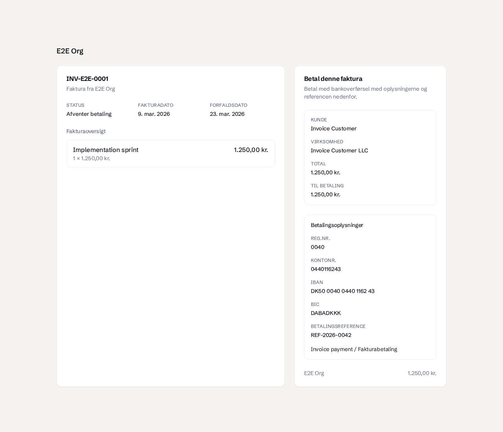
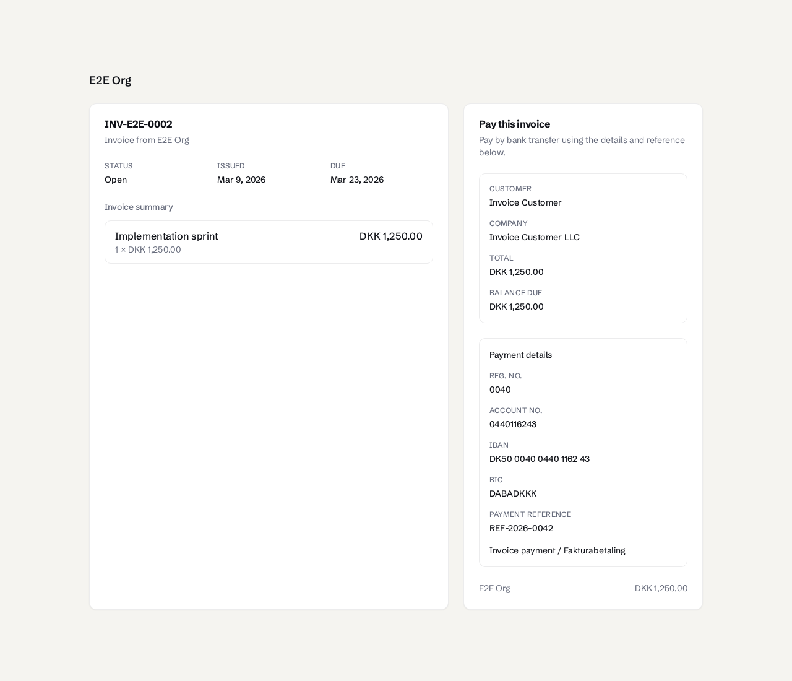
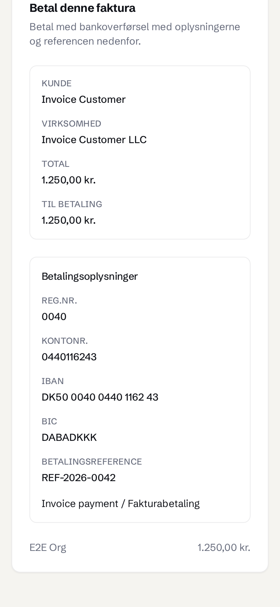
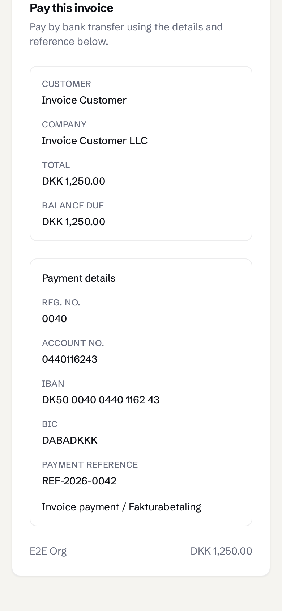

# Public bank transfer details

Actual `/pay` browser captures from an isolated local Postgres database with synthetic invoice/customer data. The seller snapshot contains the displayed account; live settings contain a different account. Stripe is unset. These are WS7 captures on main's existing styling, without the unmerged Full Stop or Danish invoice-field workstreams.

Desktop is 1280 × 1100. Mobile is 390 × 844, scrolled to the payment details. Both viewports were checked for horizontal overflow. The two invoice fixtures use DKK and their own DA/EN locale. No customer email or payment provider was contacted.

Maximum-length stress fixtures and before/after correction evidence are in [fix1](fix1/README.md).
