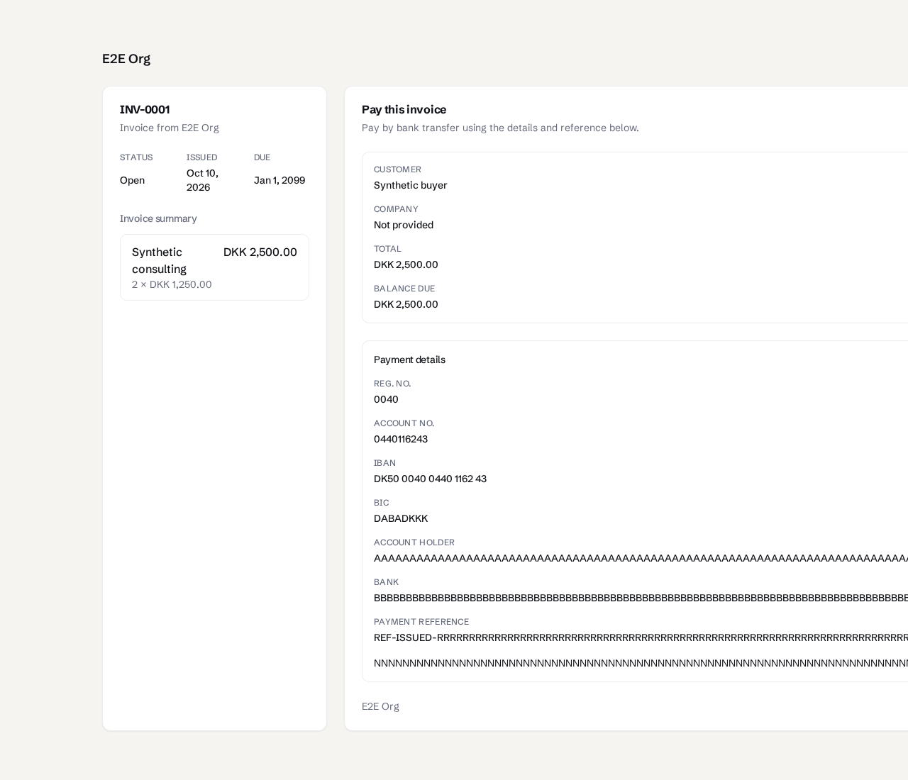
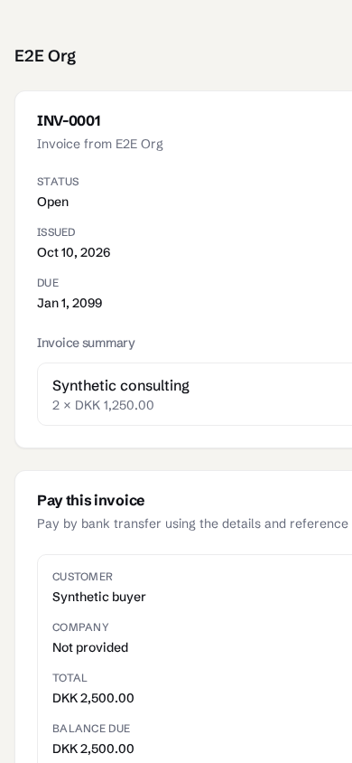
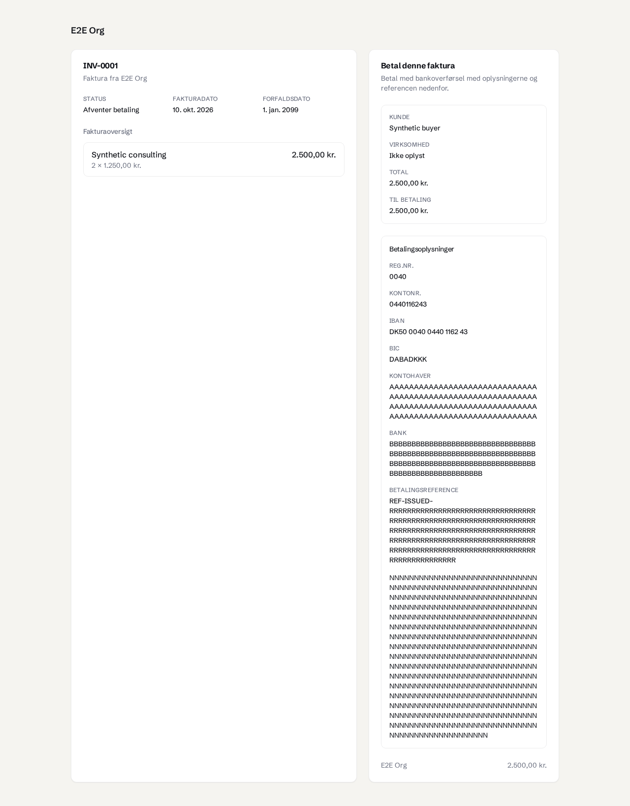
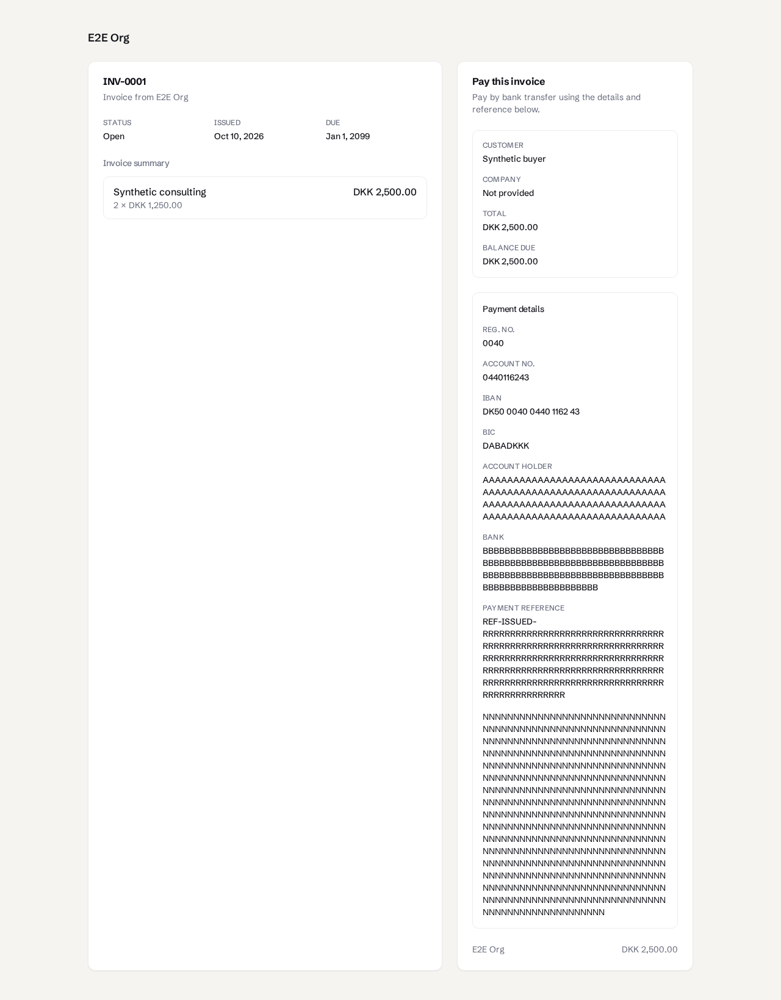
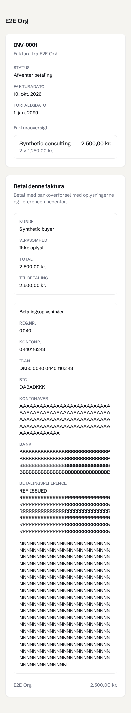
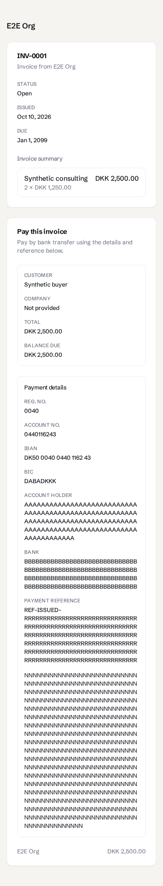

# Long-value layout regression

Fresh actual `/pay` captures from command-issued synthetic invoices on disposable Postgres 16. Settings were saved through the normal payment-details router after creating the draft: 120 unbroken A characters for the holder, 120 B characters for the bank name and 500 N characters for the note. A synthetic draft reference of `REF-ISSUED-` plus 180 R characters was stored before actual command issuance because there is no public reference-edit command. Current settings were changed afterward. No email or Stripe provider was configured. Issuance used synthetic artifact adapters, so these images establish public-page behavior, not real PDF rendering.

Desktop viewport is 1280 × 1100 and mobile is 390 × 844. After images are full-page screenshots so every wrapped value is visible. Before images show the viewport at the failed assertion. These use WS7/main styling, without the separate Full Stop or invoice-field branches.

The committed `tests/shared/public-bank-details.spec.ts` runs with `bun run test:e2e:shared -- public-bank-details.spec.ts`. All four cases failed against 12aadd4 and passed after the layout correction. DA root scrollWidth changed from 5543/5100 to 1280/390; EN changed from 5569/5100 to 1280/390. All section children fit, both cards fit the viewport, full text remains selectable, and no ancestor overflow masking is used.

