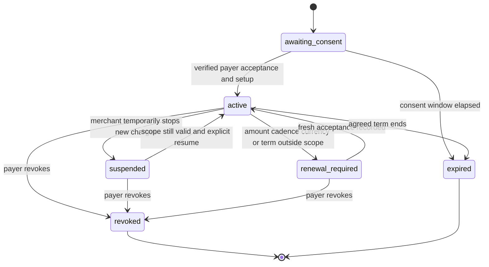
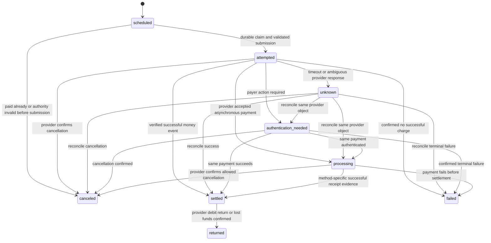

# Automatic customer-invoice collection

Decision record for [#51](https://github.com/tielemans-dev/quits-oss/issues/51), 8 October 2026.
Decision: **no-go for enabling automatic collection now**. Continue discovery. A saved-card,
DKK, fixed-amount monthly service is the first technical candidate if customer evidence supports
it. No customer demand has been validated, no provider agreement or sandbox exchange was obtained,
and no charging implementation is approved by this record.

## Evidence and scope

Source/base audited: `c0f23c014d0502c44fab9b7ea8b7a748c6b5eee8`.

| Current source | Observed behavior |
| --- | --- |
| [Stripe provider](https://github.com/tielemans-dev/quits-oss/blob/c0f23c014d0502c44fab9b7ea8b7a748c6b5eee8/apps/oss/src/lib/payments/stripe.ts), `createStripeInvoiceCheckoutSession` | Checkout `mode: payment` for the whole supplied remaining balance. This function does not create a SetupIntent, collection authority or recurring charge. |
| [Recurring commands](https://github.com/tielemans-dev/quits-oss/blob/c0f23c014d0502c44fab9b7ea8b7a748c6b5eee8/apps/oss/src/domain/commands/recurring.ts), `generateForSchedule` | Generate draft invoices and optionally enqueue auto-send. Generation is not debit consent or payment. |
| [Payment commands](https://github.com/tielemans-dev/quits-oss/blob/c0f23c014d0502c44fab9b7ea8b7a748c6b5eee8/apps/oss/src/domain/commands/payments.ts), `applyPayment`, `recordStripeCheckoutPayment` | Invoice lock and checkout-session deduplication exist. Manual excess is refused; real Stripe excess is retained. These rules do not prevent an external bank transfer racing a future saved-method debit. |
| [Stripe webhooks](https://github.com/tielemans-dev/quits-oss/blob/c0f23c014d0502c44fab9b7ea8b7a748c6b5eee8/apps/oss/src/lib/payments/webhooks.ts) | Handle paid completed/async-success Checkout sessions and async failure. Completion without `payment_status: paid` does not settle an invoice. No full saved-method mandate/return lifecycle exists here. |
| [Settlement refresh](https://github.com/tielemans-dev/quits-oss/blob/c0f23c014d0502c44fab9b7ea8b7a748c6b5eee8/apps/oss/src/domain/documents/settlement.ts) | Balance changes invalidate stale checkout. Provider expiry can be too late if a session already completed. Preserve this behavior. |

Read-only draft #71 at `9adf93f73147c9a78414fc561f05abe22bd30bcc` supplies a pure proposed
owner/version model in `docs/plans/2026-10-08-canonical-payment-schedule-design.md` and
`apps/oss/src/domain/payment-plans/`. Authority is a separate concept; actual amount/cadence
checks cover the whole recurring term, not only the next three previewed invoices. It is not
wired to jobs, persistence or providers. This decision extends its collection questions and does
not declare that prototype production-ready.

Read-only money #72 at `295d00bbb856ec79c536e33888569a29592d52dc` supplies receipt/allocation
and external-refund evidence, not provider charging/refunding side effects or approved FX/fee
posting. Read-only Denmark #66 at `7f37ed6ed93ad0d072ada6911c2936fbbf67bd87` keeps invoice
transport, acceptance and accounting handoff separate. A delivered invoice never proves debit
consent or payment. No draft was imported; no product/schema/UI changes accompany this decision.

## Sources and practical Danish candidates

All sources below were retrieved on **2026-10-08**. Citations refer to the named sections, not a
claim that an account has these capabilities enabled. The [source manifest](./evidence/2026-10-08-accounting-discovery/sources.json)
records response hashes and excerpts. Live credentials were not read or used.

| Ref | Official source and sections |
| --- | --- |
| P1 | [Stripe Setup Intents](https://docs.stripe.com/payments/setup-intents), Get permission to save a payment method; Future off-session use; Specify usage |
| P2 | [Stripe save and reuse, Setup Intents API](https://docs.stripe.com/payments/save-and-reuse?payment-ui=elements), Collect payment details; Charge the saved payment method; authentication recovery |
| P3 | [Stripe PaymentIntent lifecycle](https://docs.stripe.com/payments/paymentintents/lifecycle), lifecycle states and fulfillment |
| P4 | [Stripe idempotent requests](https://docs.stripe.com/api/idempotent_requests), stored responses, errors and key retention |
| P5 | [Stripe webhooks](https://docs.stripe.com/webhooks), Event ordering; Handle duplicate events; Verify webhook signatures; Automatic retries |
| P6 | [Cancel a Stripe PaymentIntent](https://docs.stripe.com/api/payment_intents/cancel), allowed states and processing restrictions |
| P7 | [Stripe SEPA Direct Debit](https://docs.stripe.com/payments/sepa-debit), Payment method properties; Debit notification emails; Mandates; Failed payments; Disputes; Refunds |
| P8 | [Stripe MobilePay](https://docs.stripe.com/payments/mobilepay), Payment method properties; Refunds; Disputes |
| P9 | [Vipps MobilePay Recurring API guide](https://developer.vippsmobilepay.com/docs/APIs/recurring-api/recurring-api-guide/), Agreement lifecycle; Manage/Pause/Revoke; Charges; Retry days; Idempotency Key header |
| P10 | [Betalingsservice general debtor rules, effective 1 April 2026](https://www.betalingsservice.dk/media/jmlcppl4/bs_regler_db_generelleregler_dk.pdf), §§4, 6–10 |
| P11 | [Betalingsservice creditor rules, effective 1 April 2026](https://www.betalingsservice.dk/media/r4bh0equ/bs_regler_kr_dk.pdf), §§1, 3, 6–12 |
| P12 | [Betalingsservice document catalogue](https://www.betalingsservice.dk/betalingsservice/hjaelp/vejledninger-dokumenter/?page=2), source of the current rule PDFs |
| P13 | [Leverandørservice official product page](https://www.xn--leverandrservice-sxb.dk/leverandoerservice/), business collection proposition only |
| P14 | [Danish VAT guide D.A.7.2.4, Regel and periodic payment statements](https://info.skat.dk/data.aspx?oid=2060294&vid=221020), 2026-2 |

| Candidate | Practical fit and documented limits | Conditional decision |
| --- | --- | --- |
| Bank transfer / payer standing order | Payer controls payment. Our current manual recording can reconcile a received transfer; it supplies no merchant mandate, automatic bank feed or cancellation control over a standing order. A payer can still transfer after paying by card. | Keep supported manual collection; benchmark it in interviews. Do not call it saved-method collection. |
| Saved card through Stripe | Reuse the organization's existing processor relationship if enabled. P1 requires opt-in terms covering merchant initiation, frequency and how amounts are determined. Setup can authenticate for later off-session use, but banks can require later authentication. | First technical candidate for one fixed DKK monthly invoice per period, subject to demand and account validation. |
| MobilePay through Stripe | P8 explicitly says single-use and recurring payments **No**. Full/partial refund and dispute support do not change this. | Suitable for payer-initiated checkout, not this automatic collection route. |
| Direct Vipps MobilePay Recurring API | P9 has separately accepted agreements and scheduled charges in minor units, including DKK. It has its own merchant onboarding, API and lifecycle. Payer revocation cancels due/pending charges, but already reserved charges are not canceled automatically. There is no provider pause state; merchant stops creating charges. | Alternative to validate if Danish customers prefer it. Do not infer access from existing Stripe MobilePay. |
| Betalingsservice | P11 describes recurring DKK collection, creditor agreement, CVR/tax-registration requirement, debit agreements, monthly advance notices and delivery files/receipts. P10 has rejection, return and mandate termination rules. | Danish candidate with substantial onboarding and reconciliation work. No integration or instant cancellation promise. Validate cost, lead time and file/API route before selecting. |
| Stripe SEPA Direct Debit | P7 uses EUR, not DKK presentment, and requires mandate acceptance. Asynchronous processing, advance notices and long return windows differ from cards. A Danish location alone does not prove the customer's account is reachable/eligible. | Defer for DKK-first customers; consider only evidenced EUR business demand and confirmed account support. |
| Leverandørservice | P13 markets collection between businesses. Scheme-level consent, timelines, returns and operational access were not independently established in this research. | Defer; product existence is not an approved adapter contract. |

Provider pricing, underwriting, package/API access, merchant-of-record responsibilities, supported
payer account types and actual settlement cutoffs remain unverified for a specific organization.
No fees or conversion margins are quoted as customer facts. Card authorization is not payout;
processor gross, fees, net, conversion and later returns remain separately evidenced money facts.
Do not add fees to a customer's authorized charge just because a payout is lower.

### Provider semantics that constrain the design

- Stripe P4 stores the first execution response, including a 500. Keys can be removed once at
  least 24 hours old; reusing a pruned key can create a new request. A timeout or 500 is not proof
  of no charge. Persistent local deduplication and provider-object reconciliation are required.
- Stripe P5 does not guarantee event order and can deliver duplicates. Authenticate the raw-body
  signature, verify account/object bindings and deduplicate before interpreting status. Retrieve
  current objects to resolve contradictions; a later-arriving old failure cannot undo a settled
  payment or cause a new attempt.
- Stripe P6 permits cancellation only in specified states, with processing cancellation available
  only in limited cases. A cancellation request is not a cancellation result. A succeeded payment
  needs the refund/return path; it cannot be relabeled canceled.
- Stripe SEPA P7 says ordinary notice is at least 14 calendar days, with a closer interval if
  agreed. Its provided mandate permits notice up to two calendar days in advance of future
  payments. It sends notifications automatically when using Stripe's Creditor ID. Customer notices
  need method-specific configuration; an email pause cannot suppress a required debit notice.
- Stripe SEPA P7 says most failures happen within six business days, advises waiting at least six
  business days before treating a payment as successful, and still allows later disputes. It
  documents an eight-week no-questions dispute window, then unauthorized-payment disputes up to
  13 months. Those are Stripe SEPA rules, not generic card or Betalingsservice rules.
- SEPA refunds can be partial, within 180 days; processing fees are not refunded under the cited
  policy. A bank dispute can coexist with a merchant refund and cause two credits [P7]. Preserve
  both actual facts and an exception; never silently drop the second outflow.
- Betalingsservice P10 §8.1 allows rejecting or returning the **whole** payment by the 7th of its
  payment month, received by the bank by 16:00 on the deadline day. Under §8.5, a deadline that
  falls on a non-banking day extends to the first banking day afterward. For example, Saturday
  7 November 2026 extends to Monday 9 November. Any future adapter or payer-facing explanation
  must apply a Danish banking calendar to the §8 deadlines. §8.2's later eight-week amount
  objection requires an unapproved exact amount and an amount exceeding reasonable expectation.
  §8.3 allows objections to unauthorized/incorrect payments as soon as known, no later than
  13 months. Do not label its eight-week rule unconditional like Stripe SEPA's.
- Betalingsservice P10 §10 permits agreement cancellation at any time, effective as soon as
  possible and no later than payments three banking days after Mastercard Payment Services
  receives it. Existing pending payments need their own disposition. P11 §7 requires notice in
  the preceding month; a new Quits cadence must respect that operational lead time.
- Vipps P9 has provider retries on a single charge through `retryDays`. Never create a new charge
  while that one may still retry. It requires `Idempotency-Key` on modifying V3 requests, caches
  client errors for that key, and reports 409 for reuse on a different request. No key-retention
  duration was established here; unknown outcomes must be reconciled, not retried under a new key.

The provider recommendations do not replace payer rights or an actual contract. For example,
Vipps suggests retaining active agreements until service ends, but a payer's actual revocation
must stop local debit eligibility immediately. Cancel/refund reserved work separately under the
provider's rules. Debt and service cancellation remain distinct.

## Consent and proposed authority record

A saved payment method is not itself permission to debit. Record explicit opt-in to merchant
initiated collection separately from agreement acceptance, recurring generation and saving a
method for customer-present checkout [P1]. No existing schedule is migrated to enabled debit.
No agent may manufacture consent or accept for the customer.

Proposed evidence, not a new schema in this work:

- Organization and merchant legal identity, processor account, payer/customer and method token.
  Never retain card PAN/CVC; use the provider's collection components in a later UX implementation.
- Authority identity and immutable version, scope to one obligation/recurring instruction version,
  currency, amount rule, maximum single amount, aggregate per-period ceiling, cadence/calendar,
  minimum spacing, start/end and number of authorized periods. A cap and interval alone do not
  prevent two different invoices from charging the same month's service.
- Exact terms version/hash and readable copy, payer action/time and acquisition channel, provider
  SetupIntent/mandate/agreement identifiers, authentication result, notification agreement,
  revocation mechanism and retention/access policy for evidence. Do not store unnecessary identity
  data simply because a provider example includes it.
- Status, superseded version, stop-request time, provider-confirmed stop time and scope of charges
  still in flight. Provider evidence cannot extend a narrower contractual scope.

For a first fixed-amount monthly candidate, opt-in specifies the service, DKK amount including
VAT, calendar date, term and how to stop future debits. Successful setup authenticates the method,
but later `requires_action` must bring the payer back to authenticate [P1–P3]. Calling a payment
"off-session" does not exempt it from all future authentication. Provider-specific mandate text,
SCA treatment and consent retention must be reviewed and sandbox-tested before enabling.

| Change | Proposed authority effect |
| --- | --- |
| Amount increase, changed amount formula, additional fees or overages | Renew explicit consent before charging, even if a broad old cap could accommodate it in this first scope. |
| Earlier debit, closer cadence, term extension, added runs, restart after expiry, new currency, payer or merchant | New/revised authority with fresh consent and required provider setup. Freeze existing attempts first. |
| Reduced invoice balance from a manual part payment or credit | Recompute the target; charge only the remaining amount if the approved authority and notice rule permit it. Re-notify changed amounts. Otherwise skip and request customer payment; no silent amount mutation on an in-flight attempt. |
| Later date or lower recurring price within the same term | Version and notify; no automatic inference that plan amendment consent covers debit authority. Recheck provider mandate and notification window. Conservative first pilot may request acknowledgment. |
| Scope/event-triggered collection replacing fixed cadence | Renew; #71 already treats event timing conservatively. |
| Revocation, expired mandate, replaced payment method | Stop new submission immediately. New authority/setup before future charges; do not reuse canceled mandates. |
| Pure invoice wording correction with unchanged issued debt and scope | No new debit permission follows. Keep the original target and immutable financial document history. |

These are conservative product gates, not a claim that every listed change has the same legal
consent requirement in every payment scheme. The precise provider/contract requirements prevail
where stricter. #71's plan dominance rule and full-calendar authority checks remain necessary;
they do not prove consent by themselves.

## Independent state machines

All states below are proposed. They are not wired to current runtime.

A revoked/expired record stays immutable. A new acceptance produces a new authority version or
identity; it never erases revocation. Provider stop confirmation and residual in-flight charges
are tracked alongside this local authority state.

`attempted` means submission began, not success. `unknown` and `processing` block a second
charge. `settled` means received under the recorded method policy, not irrevocable funds or bank
payout. A dispute first creates a separate contested-funds fact; its provisional withdrawal and
any later reinstatement need distinct money events. A confirmed return does not credit the sales
invoice or prove the commercial debt vanished. A provider refund has its own requested,
processing, succeeded, failed and unknown states; it is not the `canceled` charge state.

A pending cancel request is metadata on an in-flight attempt until confirmed. Do not immediately
switch to canceled or schedule a replacement. A conclusively failed/canceled attempt remains
historical. Any authorized retry is a linked attempt after reconciliation and a fresh balance,
consent and notice check, never an unqualified loop from failure to charge.

## Dispatch, idempotency and race scenarios

Create a durable collection target for one issued invoice/period/installment under one owner.
Its identity must survive plan amendments. Merely including a plan version in a unique key is
insufficient: v1 and v2 could then charge the same period twice. Within its organization, enforce one unresolved execution
for that financial target across versions and all of its payment methods. A different
organization must never match or receive its collection evidence.

Under the existing settlement/obligation locking discipline, re-read invoice/credit/receipt
balances, owner version, authority, notice delivery and any pending executions. Persist an
immutable amount/currency/authority snapshot, local attempt ID, provider idempotency key and
outbox entry before network I/O. Bind provider metadata to opaque local IDs and account scope.
Use a fenced job claim so an expired worker cannot acknowledge a newer execution.

Immediately before submission, validate the claim and stop fence again. This reduces races but
cannot make a database transaction atomic with an external bank or processor. Never promise
that a customer paying manually "before the charge date" makes a racing debit impossible.
Known scheduled, unsubmitted targets can be canceled; submitted targets need provider evidence.

| Scenario | Required sequence and financial outcome |
| --- | --- |
| Manual payment recorded before dispatch claim | Recompute balance under lock. If zero, cancel unsubmitted target. If partly paid, recompute within consent/notice rules or skip. No provider request for the old full amount. |
| Manual payment arrives after claim but before network request | Set stop/cancel fence, invalidate amount snapshot. Worker rechecks before submission. If it cannot prove no submission, use unknown and reconcile; do not assume local cancellation won. |
| Bank transfer arrives while card/debit is processing | Record real receipt. Request cancellation if supported; track pending outcome. Block alternative attempts. If both settle, preserve both gross receipts, allocate only debt, expose excess for an evidenced refund. Do not discard the second provider event. |
| Two jobs or duplicate submit requests | Same persisted target/attempt and provider key. One fenced dispatch owner; retries use identical parameters. No new charge key after timeout. |
| Request accepted but response lost | Unknown. Retrieve the recorded provider object or reconcile through trusted account-scoped identifiers. No blind POST with a new key. Missing object ID is an incident, not proof of failure. |
| Unknown result older than Stripe's key cache | Reconcile durable operation identity/provider history. Do not reuse an expired key as if it guarantees deduplication. If absence cannot be established, stay unknown for operator/provider investigation. |
| Revocation before or during submission | Stop local eligibility immediately; cancel all scheduled targets. Reconcile and request provider cancellation for in-flight ones. An already reserved Vipps charge needs its own cancellation [P9]; a late success is a money fact plus refund/review, not consent revival. |
| Amount/cadence edit with an old job queued | Compare current owner/authority versions and cancel unsent old targets. An in-flight old amount stays immutable. New target execution only after its disposition is known and new consent/notice is satisfied. |
| Customer completes old authentication link after manual payment | Recheck settlement when returning to authenticate; cancel the same provider intent when possible. If success already happened, preserve excess and resolve it. A stale link cannot create a new target. |
| Failure event arrives after success; duplicate success | Deduplicate provider event and financial transaction IDs separately. Retrieve current object if contradictory. One gross receipt and one allocation; stale failure cannot reopen retry eligibility. |
| Provider retries while merchant tries another method | Block replacement while any provider retry is possible. Cancel and confirm the provider's retry/charge first. Vipps retry days can cross the next interval [P9]. |
| Invoice credited or collection disputed during processing | Freeze new dispatch, update collectible debt, cancel if possible. A late debit becomes excess/refund work; never resurrect credited debt to fit it. |
| Refund succeeds while a bank return also arrives | Record both outflows, flag customer over-refund/recovery exception; no automatic new debit. Tax correction depends on the commercial facts, not on counting one return twice. |
| Credentials changed or callbacks from another merchant/account | Reject/quarantine mismatched evidence and preserve unknown attempts under the original account. Never retry through a new account to escape uncertainty. |

A provider-success event and a bank payout are not two receipts. Provider fees and FX are not
customer debt. Reuse #72's gross/net/fee and allocation history only after a real side-effect
adapter establishes receipt identity and idempotency. Its `record refund` command alone does not
return money. Payment return, invoice cancellation and VAT correction need separate decisions.

## Generation pause, email pause and debit cancellation

| Action | Stops | Continues unless separately changed | In-flight handling |
| --- | --- | --- | --- |
| Pause invoice generation | Future draft creation under the recurring instruction | Existing invoices, reminders and eligible collection of existing debt | Existing generated targets keep their own authority/state |
| Pause communications | Ordinary invoice/reminder emails within the stated scope | Generation, debt and charging authority | Required mandate/debit notices are separate. If a required notice cannot be sent under user preference, suspend debit eligibility rather than charge without notice. |
| Suspend future automatic collection | New debit submissions, including provider retry scheduling where controllable | Invoice generation, receivables and ordinary reminders | Cancel queued/provider-pending targets where possible and show unresolved ones |
| Revoke authority | All future use of that consent | Existing commercial obligations and their documents | Confirm provider stop separately; cancellation/refund of already submitted charges is method-specific |
| Cancel one attempt | That execution only, once cancellation is confirmed | Mandate and later permitted targets | A failure or timeout stays unresolved until reconciled |

P14 also warns that a payment statement's publication date is not automatically each invoice's
issue date. Keep generation/issuance tax dates independent of collection batches and notices.
Do not implement a single pause switch whose consequences hide these differences.

## Demand validation and staged follow-up

Demand is **unmet**. Issue links and other products' automatic-payment features are not evidence
from initial Danish service customers. The following is a proposed protocol; nobody was contacted.
The parent controls any later recruitment, provider access and pilot authorization.

Interview at least six Danish service firms and their actual invoice payer or bookkeeper where
possible. Include bank-transfer users, card users and existing scheme users. Inspect redacted
recent recurring invoices, payment dates, reconciliation effort and failed collections with consent.
Ask what automatic collection would replace, which party prefers it, whether amounts are fixed,
how customers withdraw consent, and the observed cost of late payment. Ask for cases where
manual payment works better. Record quotations, source dates, measured versus recalled values,
contrary evidence and authorization to retain anonymized findings.

A selection gate requires at least three independent firms with an evidenced recurring-collection
job and two willing pilot firms using the same narrow method/scope. Also record payer acceptance;
seller demand alone cannot validate consent UX. A qualified reviewer must approve the exact
merchant/payer role, consent, notices, SCA, cancellation and return handling. Confirm current
provider eligibility, costs, limits and access before choosing a method. No result is asserted now.

If those gates pass, create a **separate** implementation issue for one method and one invoice
per fixed monthly DKK service period. No automatic migration, advance charging, variable usage,
installation-plan debits, consumer expansion, or subscription platform follows from this record.
The follow-up needs persistence, command permissions, tenant/account binding, immutable authority
and attempt evidence, durable jobs/outbox, provider side effects, webhook reconciliation and an
operator recovery path. UX owns consent/setup/authentication/revocation flows. Existing invoice
and quote editing, numbering, payment details and PDF behavior remain unchanged until their owners
approve a joint integration.

Before an authorized pilot, a provider sandbox must demonstrate all race-table rows using test
identities. Record actual request IDs, callback IDs, object states and ledger effects. Required
measures: zero duplicate debits/receipts, zero submission after a known revocation, no second charge
while unknown, correct aggregate authority ceilings and exact minor-unit debt/fee reconciliation.
Fault injection must include a response lost after provider acceptance, delayed success after
manual settlement, out-of-order events, two workers, revoked mandate and unsupported cancellation.
This record contains scenarios, not results of those experiments.

Proposed pilot: two consenting firms, at least two full monthly cycles, manual monitoring, and
explicit caps approved by each payer. Report attempts, settled, authentication-needed, failed,
returned, refunded, unresolved and duplicate counts with denominators. Stop for any unauthorized
or duplicate debit or unexplained money difference. Compare reconciliation minutes and late-paid
invoices against each firm's prior two cycles; propose a 30% effort reduction as a decision
threshold, not an observed benefit. Rare return windows outlast a short pilot; keep a return-
reconciliation plan and do not treat two cycles as proof of irrevocability.

## Kvit UI handoff

Future UX must distinguish "Create invoice", "Send invoice" and "Collect automatically". Show
payment-method/merchant identity, exact amount rule, cadence/term, upcoming date, consent evidence
and an accessible stop action. Authentication-needed, processing, unknown and returned must be
visible states with accurate next actions. "Scheduled" cannot mean "paid"; "settled" cannot mean
immune to return. Show whether a cancellation is requested or confirmed and which existing
attempts may still settle. A manual-payment flow should show unresolved collection risk without
blocking the truthful recording of money already received. Required debit notices need their own
setting and consequence explanation. This work supplies no screens, branding or stub effects.

## Acceptance status

| #51 requirement | Status |
| --- | --- |
| Go/no-go with customer evidence, methods, consent and prerequisites | No-go recorded; method/consent/prerequisite research supplied. Customer/provider validation **unmet**. |
| Scheduled, attempted, authentication-needed, processing, settled, failed, canceled, returned states | Proposed diagrams and return/refund distinctions supplied. No runtime state machine implemented. |
| Amount/cadence, revocation, duplication, event ordering, manual-payment races | Explicit scenarios supplied; provider and integration execution **unmet**. |
| Renewal rules and uncertain-result second-charge prevention | Conservative scope/renewal and persistent reconciliation design supplied; approval and implementation **unmet**. |
| Separate measurable follow-up; recurrence not presented as collection | Conditional follow-up and pilot criteria supplied. No implementation issue created; automatic enabling rejected. |
