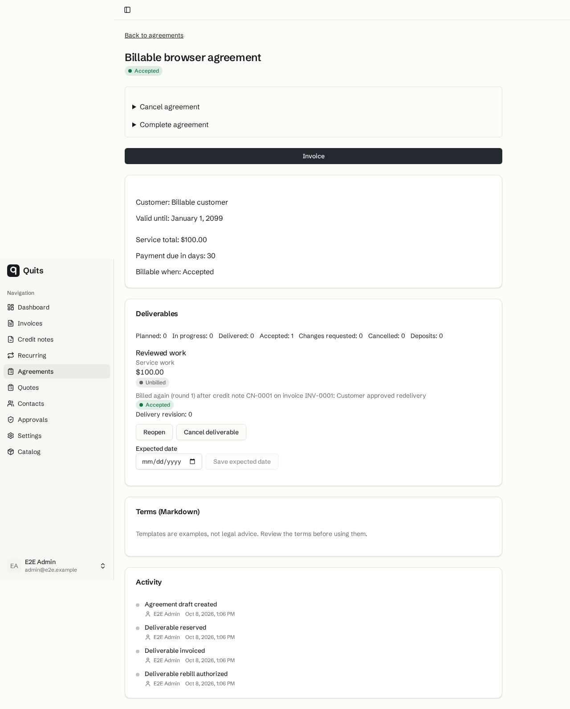
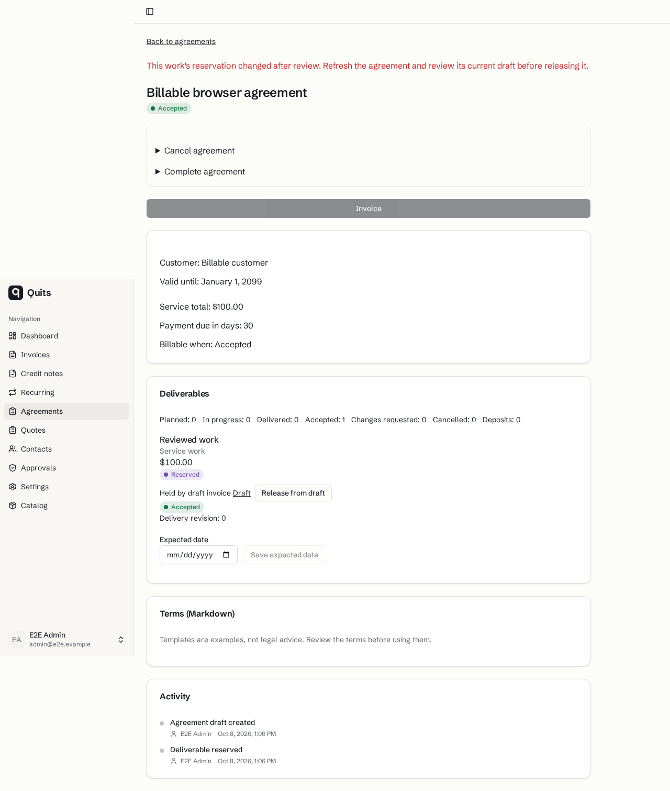

# Billable reservation browser evidence

Saved synthetic shared-browser screenshots at `07d956229907de84cc0a1c4b12268b6ab33b0aa8`. Both reservation/release and issuance/credit/rebill scenarios passed. Agreement acceptance is a synthetic starting fixture; subsequent actions use the real runtime. The screenshots precede the accepted copy-only correction at `212e6949c3e33ef6e2a68db9cea74d5f3ae8cd7f`.

These implemented new-flow and interaction states are not before-implementation baselines. The saved images predate PDF PR #64 and the current-main rebase to `715b964371d05d7736456c1496602eec3ac58724` on `c0f23c014d0502c44fab9b7ea8b7a748c6b5eee8`. Background document and tax labels are historical captures, not evidence of the current PDF/tax presentation. No video was captured.

`delivery/reviews/billable-review-2.md` records parent review. Latest rebase lint, whole typecheck and focused checks passed, as recorded in `delivery/handoffs/draft-preparation-1.json`. No new runtime or browser checks accompanied this docs-only commit. The images were visually inspected and copied byte-for-byte on 2026-10-08. Sources marked delivery are relative to `research/2026-10-08-quits-market/delivery/` in the workspace.

## rebilling authorization history

The work is unbilled after an explicit rebill authorization. The saved label says "Billed again"; the later accepted copy-only correction says "Rebilling authorized" in English and "Genfakturering godkendt" in Danish. This image does not show another issued invoice.

- Source, original shared-browser cache: `/home/mpt/.cache/quits-shared-e2e/reports/07d956229907/shared/data/6e65c89734099f27eed5636c3bb84ee84eda2098.png`
- SHA-256: `161432ec01c7c92b3dfdd0e0422869492b5207e0d71854e4827941c064a139d6`

## stale reservation release refusal

An old release confirmation refuses after the reservation changes. The work stays reserved to its current draft, and the page asks for a refresh and new review.

- Source, original shared-browser cache: `/home/mpt/.cache/quits-shared-e2e/reports/07d956229907/shared/data/481b475fd2a234e975befbbeb8e748f9ae0ac738.png`
- SHA-256: `7e3ccd3b09a7e8090cdcd3b853711470e626a0746177a3d5056259223e0b0624`
