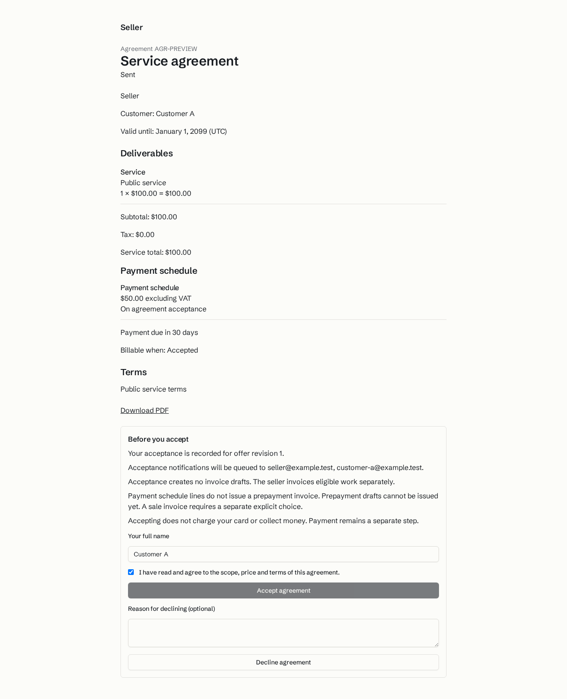
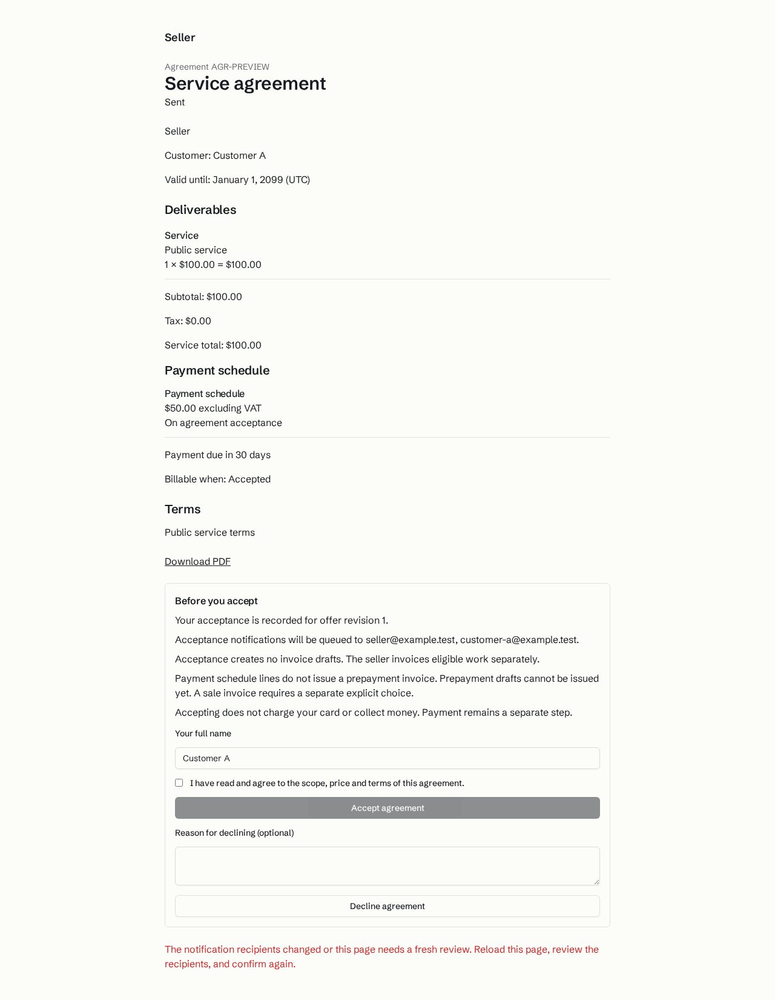

# Consequence previews browser evidence

These synthetic screenshots come from the successful shared production-build public-acceptance browser run at `2a281d1b9b37f112423e87732605485715d8a60d`. A previous clean build exposed a client import of `node:crypto`; the server-only serialization correction preceded this successful run. The round-2 head `53647dc3881632ab1d618ef6779607765fc600eb` differed only by removal of a trailing blank line in the payment-date helper. The saved images predate DCO metadata cleanup and the current-main rebase to `f4b1eaeba7d48881911f8b2ffdee9d74a083cc3e` on PDF PR #64, `c0f23c014d0502c44fab9b7ea8b7a748c6b5eee8`.

These are new-flow and interaction states from the implemented prototype. They are not before-implementation baselines. The fixtures use synthetic organizations, contacts and addresses. No video was captured.

`delivery/reviews/consequences-review-2.md` records the parent inspection. The metadata cleanup preserved the tested tree; the later rebase preserved every feature patch in range-diff. Latest rebase lint and whole typecheck passed. No new runtime or browser run accompanied this evidence-only commit.

Sources below are relative to `research/2026-10-08-quits-market/delivery/` in the workspace. The images were copied byte-for-byte and visually inspected on 2026-10-08.

## public acceptance review

The public agreement review states the offer revision, notification recipients, invoice and payment effects, with the confirmation checkbox selected.

- Source: `handoffs/consequences-round-2-evidence/8c11699ad3af0f09bffb3115a16670ffdda260e3.png`
- SHA-256: `71d2022d7d9d207e60f2a4ec387bf523028d184b25ddbed1df3255806b33ca83`

## public acceptance stale review

After recipients change, the page keeps the displayed review, clears confirmation and asks the recipient to reload and review again.

- Source: `handoffs/consequences-round-2-evidence/74c5696402f67aab0acbc6ccddc61981b41a1523.png`
- SHA-256: `699de3a75e91a2cfd7363feda2a9d233bbea9d84537809dd954caccd3446c4b5`
