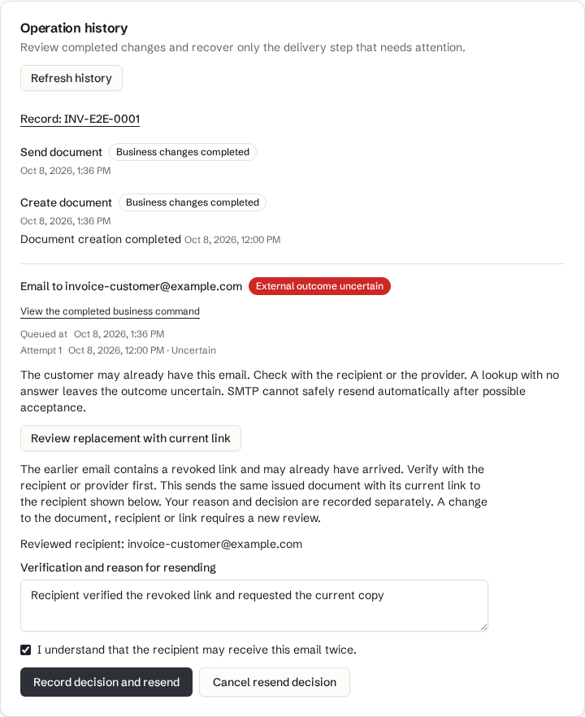
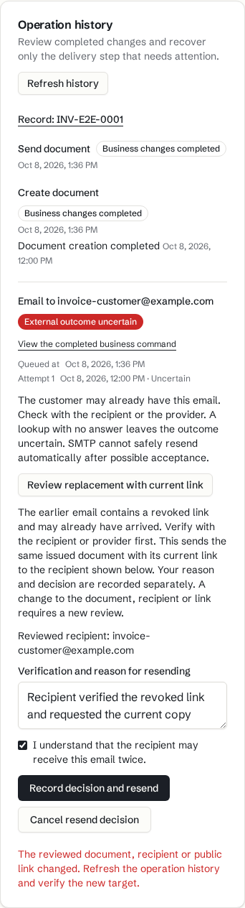

# Operation journal browser evidence

Saved synthetic shared-browser screenshots at `06a7b804439ee65fe8f2db97efb056354e6e0cbc`. The scenario covers replacement review, acknowledgement, cancellation and stale-link refusal. These images do not prove successful replacement submission; that has separate command/outbox integration evidence. DCO cleanup preserved the tested tree at `351ace99d9313e998d2415e06e251cc4e8c3e995`.

These implemented new-flow and interaction states are not before-implementation baselines. The saved images predate PDF PR #64 and the current-main rebase to `34c427ea46e3ed02df8886b42715cf7d9487dd6d` on `c0f23c014d0502c44fab9b7ea8b7a748c6b5eee8`. Background document and tax labels are historical captures, not evidence of the current PDF/tax presentation. No video was captured.

`delivery/reviews/journal-review-2.md` records parent review. Latest rebase lint, whole typecheck and focused checks passed, as recorded in `delivery/handoffs/draft-preparation-1.json`. No new runtime or browser checks accompanied this docs-only commit. The images were visually inspected and copied byte-for-byte on 2026-10-08. Sources marked delivery are relative to `research/2026-10-08-quits-market/delivery/` in the workspace.

## replacement review desktop

The desktop replacement review shows the uncertain source, current-link replacement mode, reviewed recipient, reason and acknowledgement that the recipient may receive the email twice.

- Source, delivery: `handoffs/journal-round-2-desktop.png`
- SHA-256: `cdcf14f295083f9a2756661151cf5dc7144f2ddfe62b5386c3181212825ac51e`

## stale replacement review mobile

The mobile view keeps the review controls visible and refuses a changed document, recipient or public link. It asks for a refreshed history and a new target review.

- Source, delivery: `handoffs/journal-round-2-mobile.png`
- SHA-256: `daa6be2518de82f597764074bf5958bc96df2bf420a520b9bcf05955bbdfc136`
