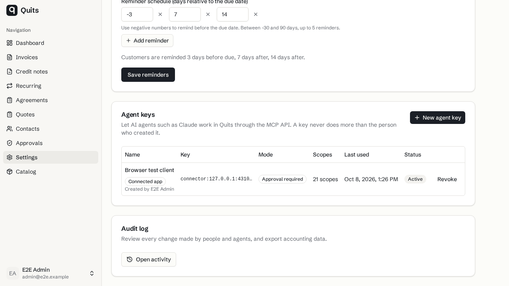
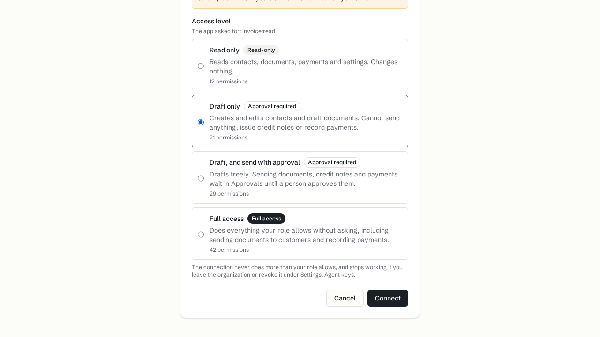

# MCP sign-in browser evidence

These synthetic screenshots come from the successful shared production-build browser run at `f1c90cfb7a73bec91ea1ce11446eaad25b01e634`. The run passed eight scenarios after a separate pre-build database startup failure. The saved images predate DCO metadata cleanup and the current-main rebase to `ecc09d5e4a98b840a585af8b21c6d0efd725434d` on PDF PR #64, `c0f23c014d0502c44fab9b7ea8b7a748c6b5eee8`.

These are new-flow and interaction states from the implemented prototype. They are not before-implementation baselines. The fixtures use synthetic organizations, contacts and addresses. No video was captured.

`delivery/reviews/mcp-review-3.md` records the parent inspection. The metadata cleanup preserved the tested tree; the later rebase preserved every feature patch in range-diff. Latest rebase lint and whole typecheck passed. No new runtime or browser run accompanied this evidence-only commit.

Sources below are relative to `research/2026-10-08-quits-market/delivery/` in the workspace. The images were copied byte-for-byte and visually inspected on 2026-10-08.

## settings connected app last used

Settings shows the synthetic Browser test client as active, with a last-used timestamp after MCP authentication.

- Source: `handoffs/mcp-round-3-evidence/shared-final/shared/data/5b438cabe1c44fc95eb75b458d9925afc27946f4.png`
- SHA-256: `cfeb3aa79cd37c27a6e355003b3d37a97ace96ee86db6ff6aff29b92d1ef514e`

## consent draft only

The consent form has Draft only selected and explains that sending, credit notes and recording payments are excluded.

- Source: `handoffs/mcp-round-3-evidence/shared-final/shared/data/9ae55386fc48ebdfed92d4bc35db43d3ba6e1b99.png`
- SHA-256: `eee67b6a0f62acfe31b2d146d270e6ff8477e45c24ac61ddda7b782127d56305`
