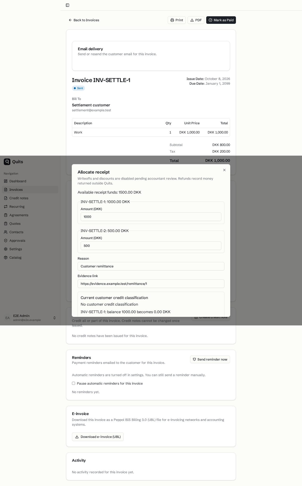
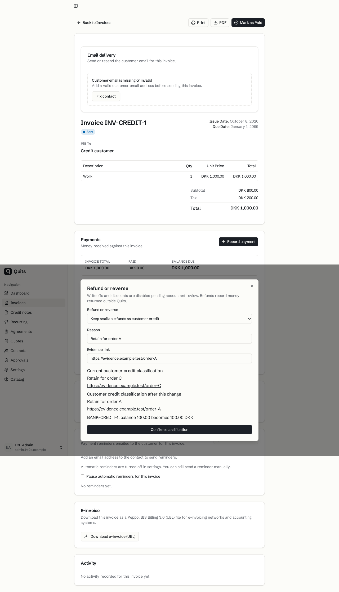

# Settlement browser evidence

Saved synthetic settlement-browser screenshots for the reviewed source at `46cce1fc5618b50e3f5db047d953882d26ae6d26`. The browser scenarios cover split allocation, reversal/refund and stale-classification review/retry. DCO cleanup preserved the tested tree at `27ea62dbd4b0737c6c30e6cfb105efd5db313108`.

These implemented new-flow and interaction states are not before-implementation baselines. The saved images predate PDF PR #64 and the current-main rebase to `66c7a17efc9e42fbcc4cc7defa3f4edf091056fa` on `c0f23c014d0502c44fab9b7ea8b7a748c6b5eee8`. Background document and tax labels are historical captures, not evidence of the current PDF/tax presentation. No video was captured.

`delivery/reviews/money-review-2.md` records parent review. Latest rebase lint, whole typecheck and focused checks passed, as recorded in `delivery/handoffs/draft-preparation-1.json`. No new runtime or browser checks accompanied this docs-only commit. The images were visually inspected and copied byte-for-byte on 2026-10-08. Sources marked delivery are relative to `research/2026-10-08-quits-market/delivery/` in the workspace.

## split allocation preview

The allocation dialog shows 1,500 DKK available and a proposed split of 1,000 DKK and 500 DKK between two invoices. The saved capture crops the lower part of the dialog.

- Source, delivery: `evidence/money-round-2/split-allocation-preview.png`
- SHA-256: `1d725e345c33e52bfc6ee6b33d1619b59ec39b478aaa1dfd4c671fe155659976`

## classification replacement preview

The correction review shows the current order-C reason/evidence and the proposed order-A replacement before confirmation. The receipt balance stays unchanged.

- Source, delivery: `evidence/money-round-2/classification-replacement-preview.png`
- SHA-256: `60919cea2a4797bb02a17013fef67d3cc7961f193c56125e190dc0c8de408cee`
